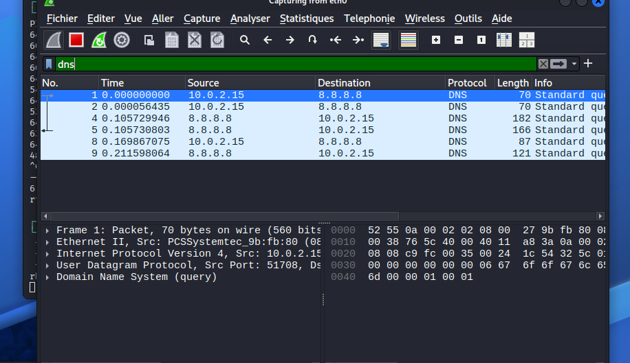
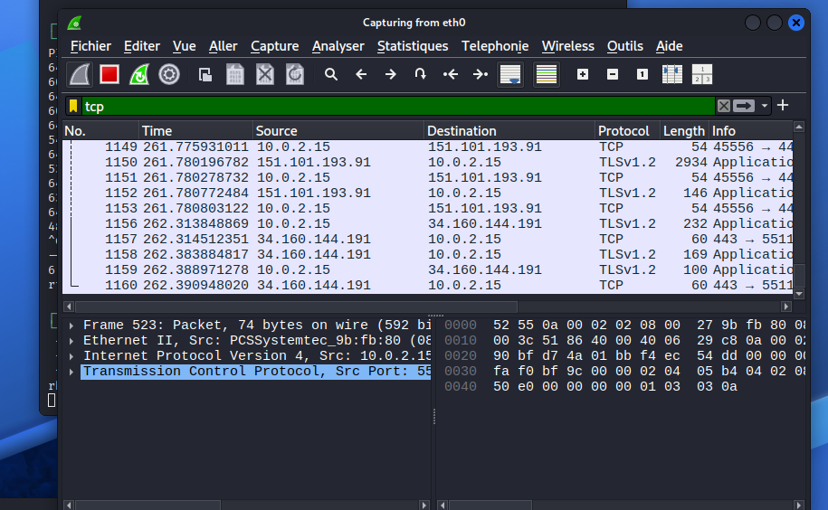

# Wireshark Network Analysis
basic network traffic analysis using Wireshark in a virtualized environment
The objective was to capture, observe and understand how devices communicate over a network using different protocols.

---
## 🇫🇷 Français

Afficher la version française

## 🇫🇷 Français

## Introduction

Ce projet présente une analyse de trafic réseau à l’aide de Wireshark dans un environnement virtualisé.  
L’objectif était de capturer, observer et comprendre comment les machines communiquent sur un réseau à travers différents protocoles.

---

## Environnement

- Système d’exploitation : Kali Linux  
- Virtualisation : VirtualBox  
- Configuration réseau : NAT + Réseau privé hôte  
- Outil utilisé : Wireshark  

---

## Objectifs

- Capturer du trafic réseau réel  
- Identifier différents protocoles (ICMP, DNS, TCP)  
- Comprendre les échanges entre une machine et des serveurs externes  
- Analyser les paquets et interpréter leur contenu  

---

## Capture de paquets

Wireshark a été utilisé pour capturer le trafic réseau sur l’interface `eth0`.  
Du trafic a été généré à l’aide de commandes ping et de navigation web.

---

## Analyse ICMP

Des paquets ICMP ont été capturés lors d’un test de ping vers `google.com`.

- Source : 10.0.2.15 (machine locale)  
- Destination : serveur externe (Google)  
- Protocole : ICMP  

Cela montre que la machine peut communiquer avec des serveurs externes et recevoir des réponses.

---

## Analyse DNS

Du trafic DNS a été observé lors de la résolution de noms de domaine.

- Source : 10.0.2.15  
- Destination : 8.8.8.8 (serveur DNS)  
- Protocole : DNS (UDP)  

La machine envoie une requête au serveur DNS pour traduire un nom de domaine en adresse IP, puis reçoit une réponse.

---

## Analyse TCP / HTTPS

Du trafic TCP utilisant TLS a été capturé lors de la navigation web.

- Protocole : TCP  
- Port : 443 (HTTPS)  
- Chiffrement : TLSv1.2  

Cela montre une communication sécurisée entre le client et les serveurs web.

---

## Résolution de problème

Lors de la configuration, la machine virtuelle n’a pas obtenu d’adresse IP via DHCP, ce qui empêchait l’accès à Internet.

Une configuration réseau manuelle a été mise en place :

- Attribution d’une adresse IP statique  
- Configuration de la passerelle par défaut  
- Configuration du serveur DNS  

Cela a permis de rétablir la connectivité réseau et de capturer le trafic.

---

## Conclusion

Ce projet a permis de comprendre concrètement le fonctionnement du réseau et des protocoles utilisés (ICMP, DNS, TCP).

La phase de résolution de problème a également permis de développer des compétences en diagnostic et configuration réseau.

---

## Compétences développées

- Capture de trafic réseau avec Wireshark  
- Analyse de paquets (ICMP, DNS, TCP)  
- Compréhension des protocoles réseau  
- Résolution de problèmes réseau  
- Configuration réseau sur machine virtuelle  

## Environment

- Operating System: Kali Linux  
- Virtualization: VirtualBox  
- Network configuration: NAT + Host-Only  
- Tool used: Wireshark  

---

## Objectives

- Capture real network traffic  
- Identify different protocols (ICMP, DNS, TCP)  
- Understand how communication happens between a client and external servers  
- Analyze packets and interpret their meaning  

---

## Packet Capture

Wireshark was used to capture network traffic on the `eth0` interface.  
Traffic was generated using ping commands and web browsing.

---

## ICMP Analysis

ICMP packets were captured during a ping test to `google.com`.

- Source: 10.0.2.15 (local machine)  
- Destination: external server (Google)  
- Protocol: ICMP  

This shows that the local machine can communicate with external servers and receive responses.

---

## DNS Analysis

DNS traffic was observed when resolving domain names.

- Source: 10.0.2.15  
- Destination: 8.8.8.8 (DNS server)  
- Protocol: DNS (UDP)  

The machine sends a request to the DNS server to resolve a domain name into an IP address.  
The DNS server responds with the corresponding IP.

---

## TCP / HTTPS Analysis

TCP traffic using TLS was captured during web browsing.

- Protocol: TCP  
- Port: 443 (HTTPS)  
- Encryption: TLSv1.2  

This demonstrates secure communication between the client and web servers.

---

## Troubleshooting

During the setup, the virtual machine did not receive an IP address via DHCP, which prevented internet connectivity.

To resolve this issue, a manual network configuration was applied:

- Static IP assignment  
- Default gateway configuration  
- DNS server configuration  

This allowed proper network connectivity and enabled packet capture.
## Screenshots

### ICMP Packet Capture

### DNS Traffic Analysis

### TCP / HTTPS Traffic

---

## Conclusion

This project provided a practical introduction to network traffic analysis.  
It demonstrated how different protocols (ICMP, DNS, TCP) are used in real communication.

The troubleshooting phase also helped develop problem-solving skills related to network configuration.

---

## Skills Demonstrated

- Network traffic capture using Wireshark  
- Packet analysis (ICMP, DNS, TCP)  
- Understanding of network protocols  
- Troubleshooting network configuration issues  
- Virtual machine network setup  

---

